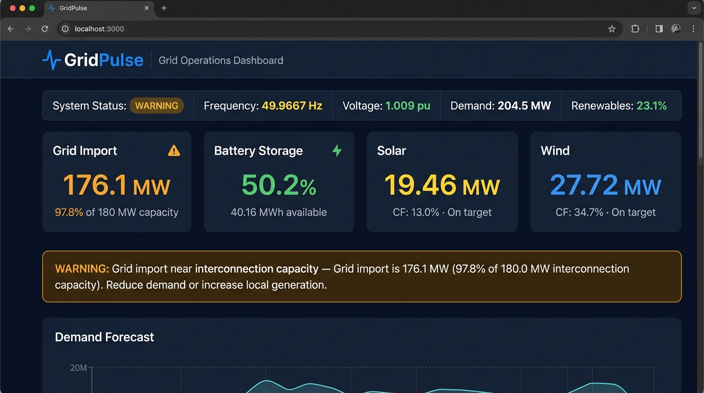
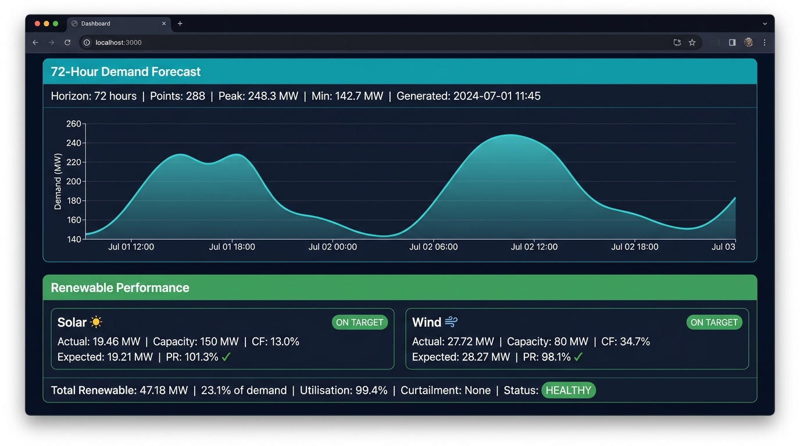
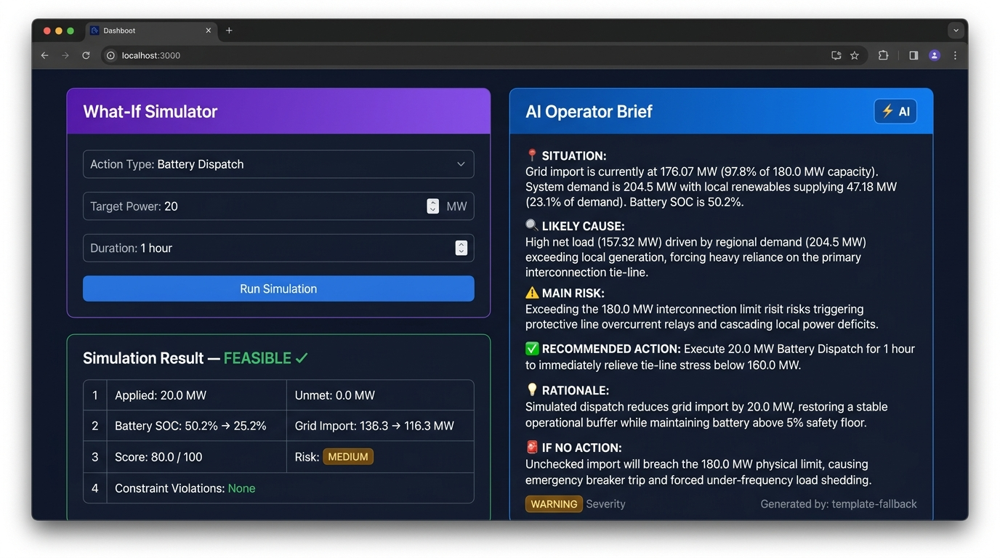

# GridPulse — Demo Screenshots

Three screenshots captured from the live running GridPulse application
(backend: `http://127.0.0.1:8000`, frontend: `http://localhost:3000`).

All values shown are real data from the simulator and API — no mocks or
placeholder text.

---

## 01-dashboard.png — Full Dashboard Overview

**What it shows:**
- System Status: WARNING (grid import at 97.8% of interconnection capacity)
- Live status bar: Frequency 49.9667 Hz · Voltage 1.009 pu · Demand 204.5 MW · Renewables 23.1%
- 4 status cards: Grid Import 176.1 MW ⚠ · Battery 50.2% · Solar 19.46 MW · Wind 27.72 MW
- Active alert: ANO-011 — "Grid import near interconnection capacity"
- Demand Forecast section header (chart visible below the fold)

---

## 02-forecast-renewables.png — Demand Forecast + Renewable Performance

**What it shows:**
- 72-hour demand forecast Recharts area chart (288 data points, Peak 248.3 MW, Min 142.7 MW)
- Solar performance: Actual 19.46 MW · CF 13.0% · PR 101.3% · **ON TARGET** ✓
- Wind performance: Actual 27.72 MW · CF 34.7% · PR 98.1% · **ON TARGET** ✓
- Combined: Total 47.18 MW · 23.1% of demand · Utilisation 99.4% · Status: **HEALTHY**

---

## 03-simulator-operator-brief.png — What-If Simulator + AI Operator Brief

**What it shows:**
- **Left:** Simulator result for `BATTERY_DISPATCH 20 MW / 1 hour`:
  - Feasibility: **FEASIBLE ✓**
  - Applied: 20.0 MW · Unmet: 0.0 MW
  - Battery SOC: **50.2% → 25.2%**
  - Grid Import: 136.3 → 116.3 MW (–20 MW relief)
  - Score: 80.0 / 100 · Risk: **MEDIUM**
  - Constraint Violations: None
- **Right:** AI Operator Brief (template-fallback engine):
  - Situation · Likely Cause · Main Risk · Recommended Action · Rationale · If No Action
  - Severity: **WARNING**

---

*Screenshots taken: 2024-07-01 (application data timestamp) / session date: 2026-09-15*
