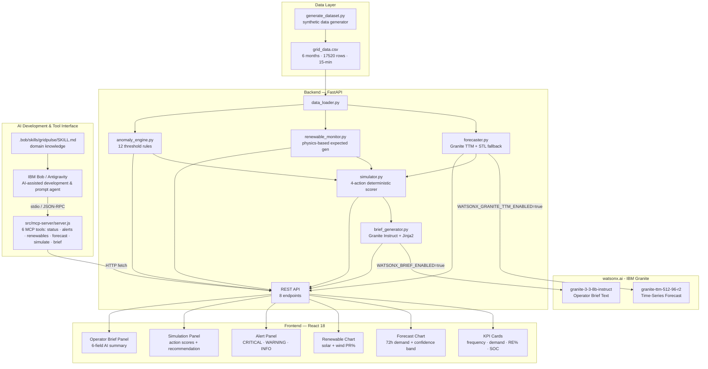

# Architecture

## System Architecture

## Architectural Distinctions

To ensure clarity regarding system boundaries:

| Layer | Technology | Role & Boundary |
|---|---|---|
| **AI-Assisted Development** | IBM Bob / Antigravity | Development environment used to scaffold, code, test, and iterate the project. Also interacts with the system via tool calls. |
| **Tool Interface Layer** | MCP Server (`@modelcontextprotocol/sdk`) | Standard Model Context Protocol interface exposing 6 tools. Does NOT run the application; acts as a bridge. |
| **Application Runtime** | FastAPI + Uvicorn (Python 3.11) | Hosts the core business logic, physics calculations, and REST API (`http://127.0.0.1:8000`). |
| **Optional Runtime AI** | watsonx.ai (IBM Granite) | Cloud foundation models invoked for zero-shot time-series forecasting and natural language operator briefs only when configured. |

## Components

| Component | Technology | Responsibility |
|---|---|---|
| Dataset | CSV + Pandas | 6-month synthetic grid data; all columns at 15-min resolution |
| Data Loader | Pandas | Load CSV, validate schema, provide rolling windows to services |
| Forecaster | Granite TTM / Seasonal Naive fallback | 72-hour demand forecast; 288 points at 15-minute resolution |
| Renewable Monitor | Pandas / NumPy | Physics-based expected generation; actual vs expected ratios; curtailment |
| Anomaly Engine | Python rules | 12 deterministic threshold rules; severity classification; alert structs |
| Simulator | Python | 72-hour what-if simulator; deterministic feasibility, battery physics, and scoring |
| Brief Generator | Jinja2 / Granite Instruct | Natural-language operator brief; watsonx.ai primary; template fallback |
| REST API | FastAPI + Pydantic v2 | Endpoints under `/api/*`; auto-generated OpenAPI docs at `/docs` |
| Frontend | React 18 + Recharts | Single-page operations dashboard; 30-second auto-refresh; interactive simulator |
| MCP Server | Node.js + `@modelcontextprotocol/sdk` | Exposes 6 GridPulse tools to IBM Bob and AI assistants for live queries |
| Bob Skill | SKILL.md | Domain knowledge loaded into Bob during development sessions |

## Data Flow

1. `generate_dataset.py` produces `grid_data.csv` with 17,520 rows of synthetic grid telemetry
2. On API request, `data_loader.py` reads the last N rows into a Pandas DataFrame
3. `forecaster.py` extracts the last 512 `demand_mw` values and calls Granite TTM (or STL fallback)
4. `renewable_monitor.py` computes expected generation from irradiance/wind speed and derives metrics
5. `anomaly_engine.py` applies all 12 rules to the latest rows; triggered rules become alert objects
6. `simulator.py` takes the 72-hour forecast, anomaly flags, and battery SOC; scores all 4 actions
7. `brief_generator.py` constructs a structured prompt from simulator output and calls Granite Instruct (or renders Jinja2 template)
8. FastAPI routers serialise outputs via Pydantic schemas and return JSON
9. React frontend polls all endpoints every 30 seconds and updates charts/panels

## API Endpoints

| Method | Path | Description |
|---|---|---|
| GET | `/health` | Health check |
| GET | `/api/status` | Current KPIs: frequency, demand, SOC, renewable % |
| GET | `/api/forecast` | 288-row 72-hour demand forecast |
| GET | `/api/renewable` | Renewable performance metrics |
| GET | `/api/alerts` | Active anomaly alerts (sorted by severity) |
| GET | `/api/simulate` | What-if simulation results for all 4 actions |
| GET | `/api/brief` | Current operator brief |
| POST | `/api/brief/refresh` | Force-regenerate the operator brief |

## Security Considerations

- API keys and credentials are stored in `.env` only — never committed (`.gitignore` enforces this)
- `.env.example` contains only placeholder values — no real credentials
- CORS is configured for development (`allow_origins=["*"]`); restrict to frontend origin in production
- No authentication is implemented — this is a hackathon prototype, not production-ready

## Scalability Notes

This is a hackathon prototype designed for reliable demo operation, not production scale. For production:
- The stateless FastAPI backend could be horizontally scaled behind a load balancer
- The CSV data layer would be replaced by a time-series database (e.g., InfluxDB or TimescaleDB)
- The watsonx.ai calls are the primary latency bottleneck and would benefit from response caching
- The Granite TTM calls could be pre-scheduled (e.g., every 15 minutes) rather than on-demand
